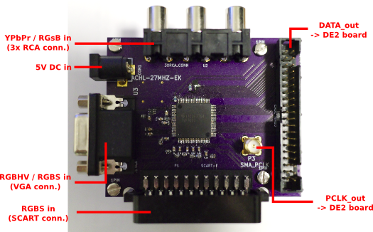
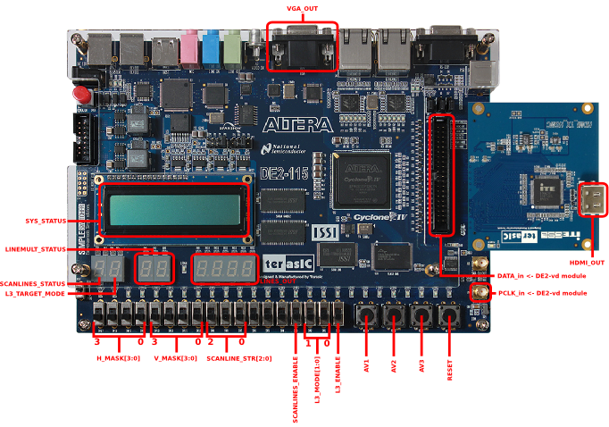

DE2-vd
==============

DE2-vd is a video digitization add-on module for Altera DE2-115 FPGA development board. Together with DE2-115, it can be used in converting analog RGB/component video into digital format with very low processing latency. The system is mainly designed for using retro game consoles / home computers on modern displays.

The module is a prototype for a single-board digitization and scan converter system to be released in the future. Therefore, the current system is targeted for developers / hobbyists interested in FPGA design and video digitization - no in-depth documentation is currently provided.

Features
--------------
* detects and digitizes various video modes from 240p to 1280x1024 (and possibly higher with future updates)
* linedouble-support for 240p, 480i, 288p, 576i
* linetriple-support for 240p with 4 different sampling modes
* very low latency (less than 2 input scanlines)
* single-field "deinterlace" for 480i/576i: minimal latency overhead with decent image quality
* quick recover from input video mode change (e.g. 240p<->480i)
* all video processing done in RGB domain - no conversion to YCbCr
* multiple inputs supporting various formats
 * RGBS via SCART connector
 * RGBHV/RGBS via VGA connector
 * YPbPr/RGsB via 3xRCA connector
* Two possible output methods
 * full-range RGB output through HDMI
 * analog RGB output through VGA DAC
* emulated scanlines with configurable strength
* configurable mask for overscan area
* configurable horizontal sample rate (only limited by display support)
* fully open source: rtl, software and pcb design files all avaiable for modification

Required HW and SW
---------------------------------------------------
* Hardware
 * [Altera DE2-115 FPGA development board](http://www.terasic.com.tw/cgi-bin/page/archive.pl?Language=English&CategoryNo=139&No=502)
 * [HDMI Transmitter Daughter Card](http://www.terasic.com.tw/cgi-bin/page/archive.pl?Language=English&CategoryNo=66&No=582) (optional, for HDMI output)
 * DE2-vd [PCB](https://oshpark.com/shared_projects/yam1ykak) and [components](pcb/BOM_mouser.xls)
 * SMA and 2x20 ribbon cables between the boards (as short as possible)
 * 5V DC power supply (min. 1A, 1.3/4.5mm center positive)

* Software
 * [Altera Quartus II](http://dl.altera.com/?edition=web) (v 14.1 or higher - free Web edition available)
 * [Altera University Program IP](http://www.altera.com/education/univ/software/upds/unv-upds.html) (for on-board LCD character display)

Connection diagrams
------------------------------

DE2-vd module connections

DE2-115 board controls and connections

Build instructions
--------------------------
1. Edit rtl/output_sel.v.example to suit your setup, and save the modified file into rtl/output_sel.v
2. Load the project (videoproc.qpf) in Quartus II
3. Generate the FPGA bitstream (Processing -> Start Compilation)
4. Program the bitstream into the FPGA using either JTAG (volatile/.sof) or AS programming (nonvolatile/.pof) method

Usage
--------------------------
After programming the FPGA, the character LCD should display "INIT OK" if the connection between the boards is operational.

### Input selection ###

Active input and format can be selected by using the 3 leftmost push-buttons on the board (see connection diagram). The inputs and corresponding connectors and formats are listed in the following table. The format within one input can be switched by pressing the same input button again.

Input | Connector | Format
------| ----------|-------
AV1 | SCART | RGBS (csync or cvbs as sync)
AV2 | VGA | RGBHV
 |  | RGBS (csync connected to pin 13)
AV3 | 3xRCA | YPbPr
 | | RGsB

### Line multiplier configuration ###

With SD video input, the line multiplier is activated in order to generate an output which is accepted by the target display. By default, the system uses linedouble and a horizontal sampling rate which results to 720 active pixels (720x480 with 60Hz, 720x576 with 50Hz). This is a standard mode which is compatible with basically all HDMI-enabled displays.

With 240p input, it is possible to improve output quality by enabling linetripler (L3_ENABLE=1) and selecting a suitable sampling mode (L3_MODE). This allows sampling the input video with a rate which matches the rate of the DAC generating the video, or alternatively with significant oversampling. Moreover, the output resolution (1280x720) is closer to the native resolution of modern displays, resulting to less scaling. There features reduce the softness resulting from inoptimal sampling and/or scaling. The sampling modes are as follows:

L3_MODE[1:0] | Number | Description
------- | ------------|------------
00 | 0 | Input sampled at full 1280 horizontal, resulting to 1280x720 effective area. Generic oversampling mode for 16:9 video.
01 | 1 | Input sampled at 960 horizontal, resulting to 960x720 effective area. Generic oversampling mode for 4:3 video.
10 | 2 | Input sampled at 320 horizontal, multiplied by 3 in horizontal direction resulting to 960x720 effective area. A mode suitable for 320x240 input, e.g. PSX, N64.
11 | 3 | Input sampled at 256 horizontal, multiplied by 4 in horizontal direction resulting to 1024x720 effective area. A mode suitable for 256x240 input, e.g. SNES, MD.

NOTE: the 1280x720 mode outputted by linetripler does not match the standardized 1280x720 mode and is not guarateed to work correctly on all displays.

### Scanlines ###

Emulated scanlines can be enabled with SCANLINES_ENABLE-switch, and their strength is adjusted by SCANLINE_STR[2:0]. Scanlines are active every other output line with linedouble/bare digitize, and every third output line with linetriple.

### Border masking ###

Up to 15 pixels of input video's borders can be masked with black bars in horizontal and vertical direction via H_MASK[3:0] and V_MASK[3:0] switches.
